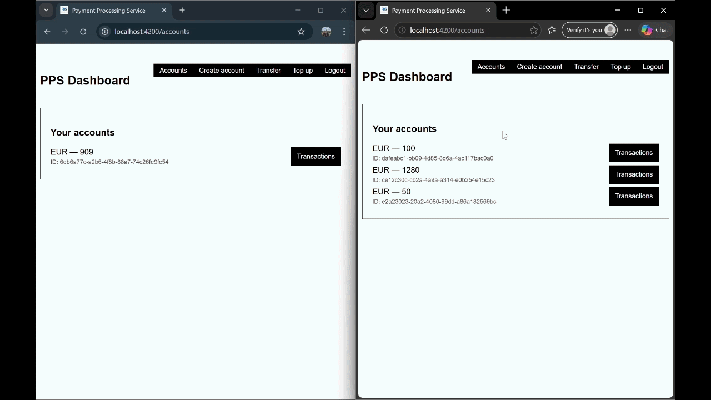
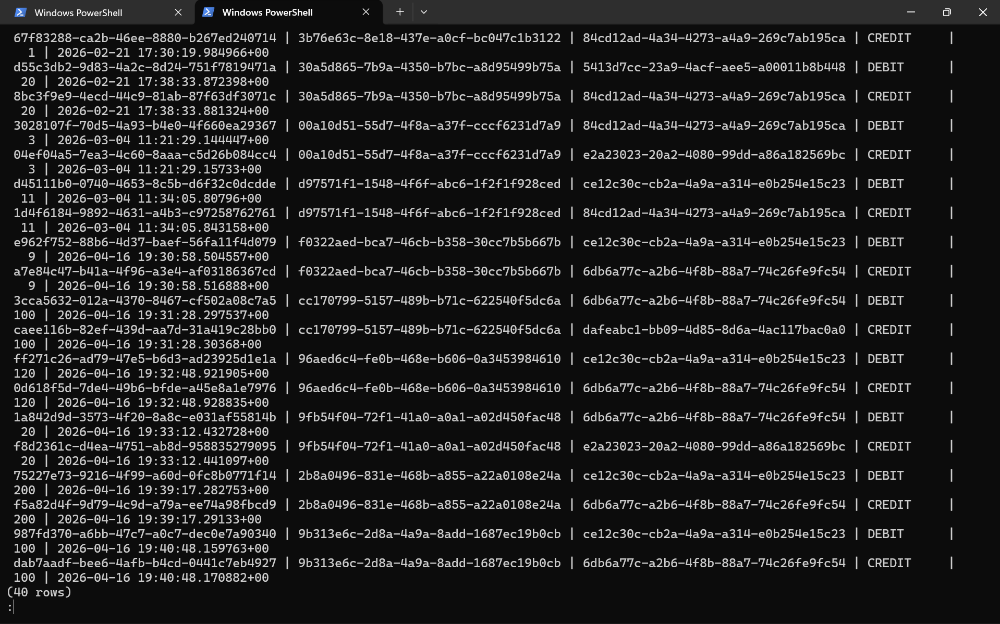
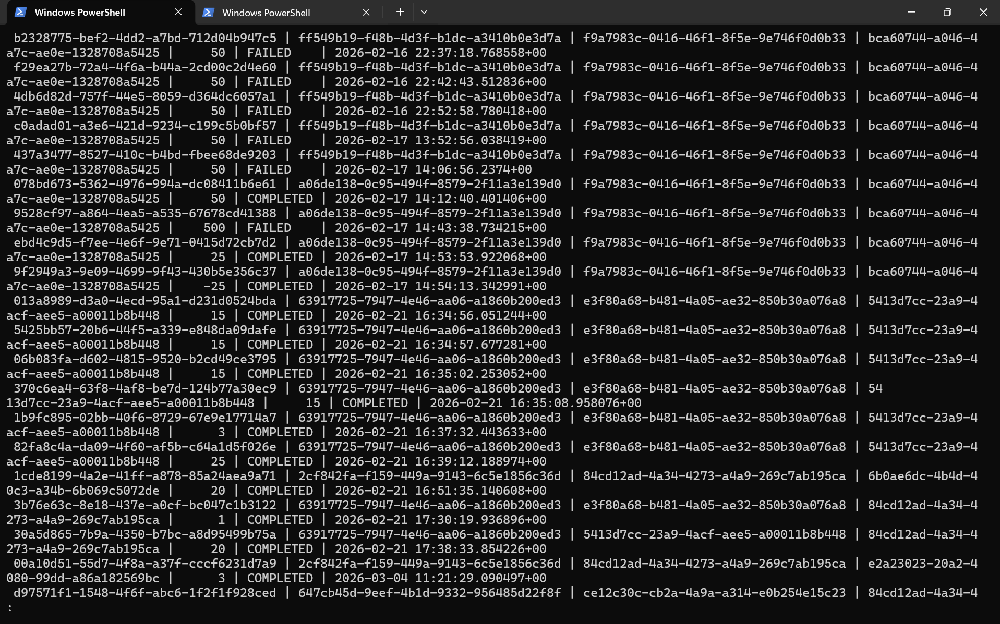
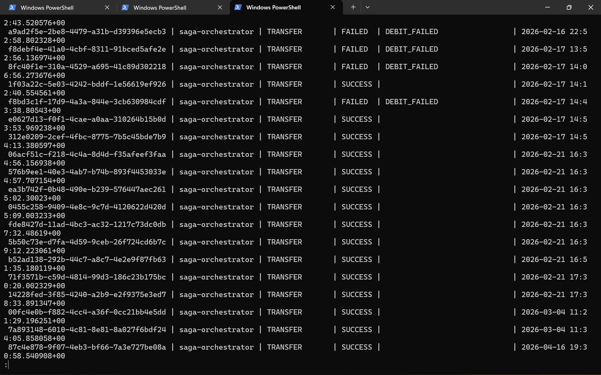

# Payment Processing Service

A full-stack, microservice-based payment processing system built in **Rust**, demonstrating core principles of financial backend engineering: distributed transaction consistency, double-entry accounting, idempotent payment handling, and end-to-end auditability.

## Demo

  


## Motivation

Financial systems have uniquely strict correctness requirements - money must never be created or destroyed due to a software failure, every operation must be traceable, and duplicate execution of a payment must be safely rejected. This project was built to explore and implement those constraints from first principles, without relying on managed payment infrastructure.


## Architecture

The system is decomposed into six independently deployable services, each owning its own PostgreSQL database - no shared state, no cross-service DB access.

| Service | Responsibility |
|---|---|
| **Auth Service** | User registration, login, JWT issuance & validation |
| **Account Service** | Account lifecycle, balance storage, debit/credit operations |
| **Payment Service** | Payment record management, idempotency enforcement, status tracking |
| **Ledger Service** | Double-entry bookkeeping - every transfer produces a paired DEBIT + CREDIT entry |
| **Audit Service** | Append-only event log of all system actions and outcomes |
| **Saga Orchestrator** | Coordinates the distributed payment workflow across all services |

An **Angular** frontend serves as the client, communicating with the orchestrator and auth service through an **nginx** reverse proxy.


## Key Financial Engineering Concepts

### Orchestrated Saga Pattern
Rather than using distributed ACID transactions (which don't exist across independent databases), the system implements an **Orchestrated Saga** - a sequence of local transactions with explicit compensating actions on failure.

Payment execution flow:
1. Create payment record (status: PENDING)
2. Debit source account
3. Record DEBIT entry in ledger
4. Credit destination account
5. Record CREDIT entry in ledger
6. Mark payment as COMPLETED
7. Write SUCCESS event to audit log

If any step fails, the orchestrator executes compensating transactions in reverse - reversing debits/credits, creating offsetting ledger entries, marking the payment FAILED, and recording the failure reason in the audit log. This guarantees **no partial state**: money is never debited without appearing in the ledger.

### Double-Entry Accounting
The Ledger Service enforces the fundamental principle of accounting: every transaction generates exactly two entries - a debit from one account and a credit to another. This makes the ledger self-consistent and auditable; the sum of all debits always equals the sum of all credits.



### Idempotency & Basic Fraud Prevention
The Payment Service tracks payment state, preventing duplicate execution of the same payment. The orchestrator also rejects semantically invalid requests at the boundary - same-account transfers and non-positive amounts are caught before any state changes occur.



### Audit Trail
Every system action - successful or failed - is recorded in an append-only 
event log. No entry is ever modified or deleted, making the full history 
of any payment fully traceable.



### JWT-Based Inter-Service Authorization
All protected endpoints require a JWT issued by the Auth Service. The token is propagated by the frontend through the orchestrator to downstream services, which validate it independently - no single auth bottleneck.


## Technology Stack

- **Rust** - primary language for all backend services
- **Axum** - async HTTP framework (Tower ecosystem)
- **PostgreSQL** - one isolated database per service
- **SQLx** - compile-time verified async SQL
- **Docker & Docker Compose** - full containerized deployment
- **nginx** - reverse proxy, port isolation, static frontend serving
- **Angular** - frontend SPA
- **JWT** - stateless authentication across services


## What This Demonstrates

- Practical application of the **Saga pattern** for distributed transaction management - a standard approach in production payment systems (Stripe, Adyen, and similar platforms use equivalent patterns at scale)
- Understanding of **double-entry accounting** as a correctness mechanism, not just a bookkeeping convention
- **Database-per-service** isolation and the trade-offs it introduces (eventual consistency vs. strong isolation)
- Secure service-to-service communication with propagated authentication tokens
- Building financial systems in **Rust** - a language increasingly adopted in fintech for its memory safety guarantees and performance characteristics

## How to Run

  **Prerequisites:** Docker & Docker Compose 
  (plus Docker Desktop for Windows users)

  ```bash
  git clone https://github.com/maksimprivalov/payment-processing-service.git

  cd payment-processing-service

  docker compose up --build
  ```

  Open http://localhost:4200 in your browser.

  Also, you may need to apply migrations for each of the service database, e.g. for account service ```/account-service/migrations/001_init.sql```